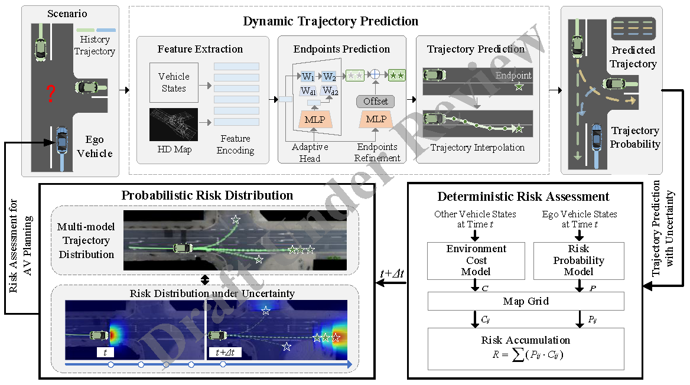
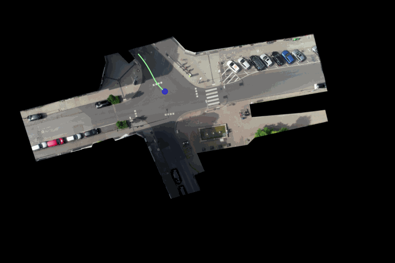
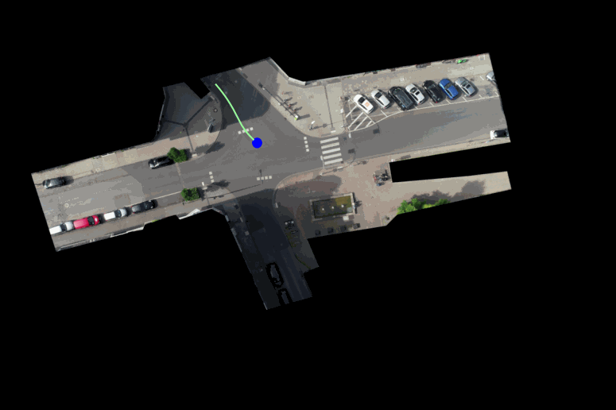

# Uncertainty-Aware Probabilistic Risk Quantification of SOTIF for Autonomous Vehicles

## Abstract
Ensuring the Safety of the Intended Functionality (SOTIF) for autonomous vehicles (AVs) is critical. Effective risk assessment helps AVs make decisions and avoid risks. However, current methods struggle with environmental uncertainties, lack comprehensive multi-dimensional risk quantification, and suffer from limited prediction accuracy. To address this issue, we propose a probabilistic dynamic risk assessment framework that quantifies the risk of AVs violating safety norms and calculates the expected average severity of such violations in uncertain environments. We first establish a general SOTIF risk model to characterize the static risk of the AV and surrounding traffic participants. Following this, we introduce a method for predicting dynamic uncertainty risks, resulting in probabilistic risk quantification. This framework is designed to accommodate multi-dimensional uncertainties and enhance safety under dynamic conditions. Extensive evaluations across typical traffic scenarios—including highways, intersections, and roundabouts—demonstrate that our method outperforms typical algorithms like Time Headway (THW), and Time-to-Collision (TTC). Empirical studies in extreme scenarios further validate the framework's ability to reduce risks and improve system generalization.

This paper is currently being submitted to IEEE International Conference on Robotics and Automation (ICRA).
## Framework Overview


*Figure 1: Overview of probabilistic dynamic risk assessment framework.*

## Demo

### Stage 1: Deterministic Risk Assessment

||
---|---|---|

*Figure 1-1: risk model in highway scenario.*

||
---|---|---|

*Figure 1-2: risk model in intersection scenario.*


||
---|---|---|

*Figure 1-3: risk model in roundabout scenario.*

For more details about the deterministic method, please refer to the our previous work on this topic via the following link: https://github.com/idslab-autosec/risk
### Stage 2: Uncertainty-Aware Probabilistic Risk Distribution

Compared to deterministic approaches, the Uncertainty-Aware Probabilistic Risk Distribution takes into account the uncertainties in the traffic environment. It aims to predict the risk distribution over a future time horizon $\Delta t$ based on a given time $t$.

Trajectory Prediction
|

## Quick Start

### Prerequisites

- Python 3.8 (Tested only in Python 3.8, other versions not verified)
- Required Python packages listed in `requirements.txt`

### Installation

1. Clone the repository:
    ```bash
    git clone https://github.com/idslab-autosec/risk_uncertainty.git
    cd risk_uncertainty
    ```

2. Install required packages:
    ```bash
    pip install -r requirements.txt
    ```
    
    OR 
    
    manual install packages: numpy,scipy,pandas,matplotlib and opencv-python
    ```bash
    pip install numpy scipy pandas matplotlib opencv-python
    
    ```
3. Prepare the datasets:
    - Download the required datasets from the following sources:
        - [inD Dataset](https://www.ind-dataset.com/)
        - [highD Dataset](https://www.highd-dataset.com/)
        - [rounD Dataset](https://www.round-dataset.com/)
    - Extract the datasets to a designated directory (e.g., `data/`):
        ```bash
        mkdir data
        unzip path_to_ind_dataset.zip -d data/
        unzip path_to_highd_dataset.zip -d data/
        unzip path_to_round_dataset.zip -d data/
        ```
    - Ensure the directory structure is as follows:
        ```
        risk_assessment_model/
        ├── data/
        │   ├── inD/
        │   ├── highD/
        │   └── rounD/
        └── ...
        ```

### Deterministic Method Quick Start

1. Run the `quick_run.py` file:
    ```python
    python quick_run.py
    ```
### Uncertainty-Aware Probabilistic Risk Distribution Method Quick Start

Coming soon.

## Datasets

Our model was validated using the following real-world datasets:

- [inD](https://levelxdata.com/ind-dataset/)
- [highD](https://levelxdata.com/highd-dataset/)
- [rounD](https://levelxdata.com/round-dataset/)

## Contributions

We welcome contributions to enhance this project. Please fork the repository and create a pull request with your changes.

## License

This project is licensed under the MIT License - see the [LICENSE](LICENSE) file for details.